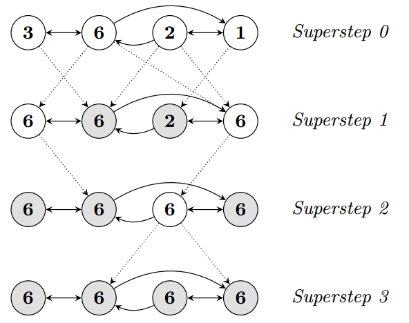
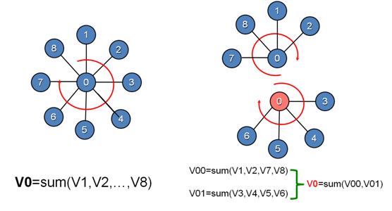
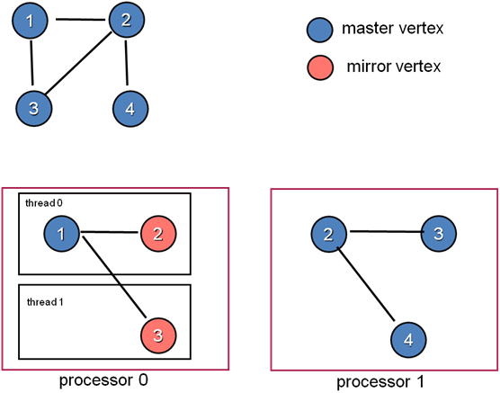
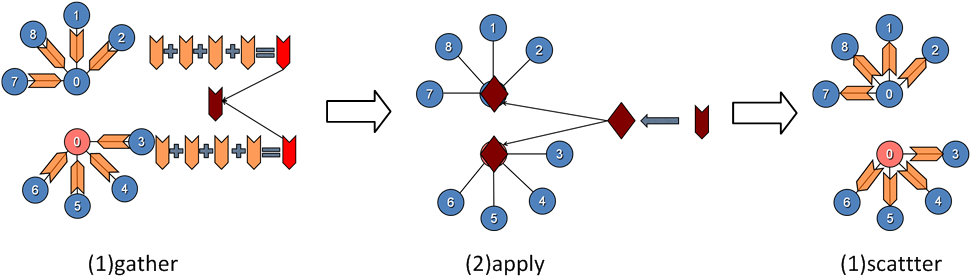

# 分布式图计算

&emsp;&emsp;在介绍`GraphX`之前，我们需要先了解分布式图计算框架。简言之，分布式图框架就是将大型图的各种操作封装成接口，让分布式存储、并行计算等复杂问题对上层透明，从而使工程师将焦点放在图相关的模型设计和使用上，而不用关心底层的实现细节。
分布式图框架的实现需要考虑两个问题，第一是怎样切分图以更好的计算和保存；第二是采用什么图计算模型。下面分别介绍这两个问题。

# 1 图切分方式

&emsp;&emsp;图的切分总体上说有点切分和边切分两种方式。

- 点切分：通过点切分之后，每条边只保存一次，并且出现在同一台机器上。邻居多的点会被分发到不同的节点上，增加了存储空间，并且有可能产生同步问题。但是，它的优点是减少了网络通信。

- 边切分：通过边切分之后，顶点只保存一次，切断的边会打断保存在两台机器上。在基于边的操作时，对于两个顶点分到两个不同的机器的边来说，需要进行网络传输数据。这增加了网络传输的数据量，但好处是节约了存储空间。

&emsp;&emsp;以上两种切分方式虽然各有优缺点，但是点切分还是占有优势。`GraphX`以及后文提到的`Pregel`、`GraphLab`都使用到了点切分。

# 2 图计算框架

&emsp;&emsp;图计算框架基本上都遵循分布式批同步（`Bulk Synchronous Parallell,BSP`）计算模式。基于`BSP`模式，目前有两种比较成熟的图计算框架:`Pregel`框架和`GraphLab`框架。下面分别介绍这些知识点。

## 2.1 BSP

### 2.1.1 BSP基本原理

&emsp;&emsp;在`BSP`中，一次计算过程由一系列全局超步组成，每一个超步由并发计算、通信和同步三个步骤组成。同步完成，标志着这个超步的完成及下一个超步的开始。
`BSP`模式的准则是批量同步(`bulk synchrony`)，其独特之处在于超步(`superstep`)概念的引入。一个`BSP`程序同时具有水平和垂直两个方面的结构。从垂直上看,一个`BSP`程序由一系列串行的超步(`superstep`)组成,如图所示:

<div  align="center"></div><br />

&emsp;&emsp;从水平上看，在一个超步中，所有的进程并行执行局部计算。一个超步可分为三个阶段，如图所示:

<div  align="center"></div><br />

- 本地计算阶段，每个处理器只对存储在本地内存中的数据进行本地计算。
- 全局通信阶段，对任何非本地数据进行操作。
- 栅栏同步阶段，等待所有通信行为的结束。

### 2.1.2 BSP模型特点

&emsp;&emsp;BSP模型有如下几个特点：

- 1 将计算划分为一个一个的超步(`superstep`)，有效避免死锁;

- 2 将处理器和路由器分开，强调了计算任务和通信任务的分开，而路由器仅仅完成点到点的消息传递，不提供组合、复制和广播等功能，这样做既掩盖具体的互连网络拓扑，又简化了通信协议；

- 3 采用障碍同步的方式、以硬件实现的全局同步是可控的粗粒度级，提供了执行紧耦合同步式并行算法的有效方式

## 2.2 `Pregel`框架

&emsp;&emsp;`Pregel`是一种面向图算法的分布式编程框架，采用迭代的计算模型：在每一轮，每个顶点处理上一轮收到的消息，并发出消息给其它顶点，并更新自身状态和拓扑结构（出、入边）等。

&emsp;&emsp;`Pregel`计算包含一连串的`Supersteps`，在每个`Superstep`中，框架对所有的顶点调用一个用户自定义的函数。该函数读取当前节点`V` 在上一个`superstep`中接收到的消息，向其它顶点（可以是任何节点，数目可变）发送消息（用于下一个`superstep`），更改`V`的状态和出边。
在超步0中，每个顶点都处在活动状态。所有处于活动状态的顶点都参与到超步的计算，并且活动的顶点通过`投票停止`而进入不活动状态。如果接收到消息，则重新激活。当没有活动的顶点和消息时，整个算法结束。简单的状态机如下图所示：

<div  align="center"></div><br />

&emsp;&emsp;我们用`PageRank`为例来说明`Pregel`的计算过程。

```c++
def PageRank(v: Id, msgs: List[Double]) {
// 计算消息和
var msgSum = 0
for (m <- msgs) { msgSum = msgSum + m }
// 更新 PageRank (PR)
A(v).PR = 0.15 + 0.85 * msgSum
// 广播新的PR消息
for (j <- OutNbrs(v)) {
msg = A(v).PR / A(v).NumLinks
send_msg(to=j, msg)
}
// 检查终止
if (converged(A(v).PR)) voteToHalt(v)
}
```

&emsp;&emsp;以上代码中，顶点`v`首先接收来自上一次迭代的消息，计算它们的和。然后使用消息和重新计算`PageRank`，之后程序广播这个重新计算的`PageRank`的值到顶点`v`的所有邻居，最后程序判断算法是否应该停止。

&emsp;&emsp;这个模型虽然简单，但是缺陷明显，那就是对于邻居数很多的顶点，它需要处理的消息非常庞大，而且在这个模式下，它们是无法被并发处理的。所以对于符合幂律分布的自然图，这种计算模型下很容易发生假死或者崩溃。

## 2.3 `GraphLab`框架

&emsp;&emsp;`GraphLab`将数据抽象成`Graph`结构，将基于顶点切分的算法的执行过程抽象成Gather、Apply、Scatter三个步骤。以下面的例子作为一个说明。

<div  align="center"></div><br />

&emsp;&emsp;示例中，需要完成对`V0`邻接顶点的求和计算，串行实现中，`V0`对其所有的邻接点进行遍历，累加求和。而`GraphLab`中，将顶点`V0`进行切分，将`V0`的边关系以及对应的邻接点部署在两台处理器上，各台机器上并行进行部分求和运算，然后通过`master`顶点和`mirror`顶点的通信完成最终的计算。

### 2.3.1 `GraphLab`框架的数据模型

&emsp;&emsp;对于分割的某个顶点，其被部署到多台机器，一台机器作为`master`顶点，其余机器作为`mirror`。`Master`作为所有`mirror`的管理者，负责给`mirror`安排具体计算任务;`mirror`作为该顶点在各台机器上的代理执行者，与`master`数据的保持同步。

&emsp;&emsp;对于某条边，`GraphLab`将其唯一部署在某一台机器上，而对边关联的顶点进行多份存储，解决了边数据量大的问题。

&emsp;&emsp;同一台机器上的所有`edge`和`vertex`构成一个`local graph`,在每台机器上，存在一份本地`id`到全局`id`的映射表。`vertex`是一个进程上所有线程共享的，在并行计算过程中，各个线程分摊进程中所有顶点的`gather->apply->scatter`操作。

&emsp;&emsp;我们用下面这个例子说明，`GraphLab`是怎么构建`Graph`的。图中，以顶点`v2`和`v3`进行分割。

<div  align="center"></div><br />

### 2.3.2 `GraphLab`框架的执行模型

&emsp;&emsp;每个顶点每一轮迭代经过`gather->apple->scatter`三个阶段。

- 1 **Gather阶段**，工作顶点的边从连接顶点和自身收集数据。这一阶段对工作顶点、边都是只读的。

- 2 **Apply阶段**，`Mirror`将`gather`计算的结果发送给`master`顶点，`master`进行汇总并结合上一步的顶点数据，按照业务需求进行进一步的计算，然后更新`master`的顶点数据，并同步给`mirror`。`Apply`阶段中，工作顶点可修改，边不可修改。

- 3 **Scatter阶段**，工作顶点更新完成之后，更新边上的数据，并通知对其有依赖的邻结顶点更新状态。这`scatter`过程中，工作顶点只读，边上数据可写。

&emsp;&emsp;在执行模型中，`graphlab`通过控制三个阶段的读写权限来达到互斥的目的。在`gather`阶段只读，`apply`对顶点只写，`scatter`对边只写。并行计算的同步通过`master`和`mirror`来实现，`mirror`相当于每个顶点对外的一个接口人，将复杂的数据通信抽象成顶点的行为。

&emsp;&emsp;下面这个例子说明`GraphLab`的执行模型：

<div  align="center"></div><br />

&emsp;&emsp;利用`GraphLab`实现的`PageRank`的代码如下所示：

```c++
//汇总
def Gather(a: Double, b: Double) = a + b
//更新顶点
def Apply(v, msgSum) {
A(v).PR = 0.15 + 0.85 * msgSum
if (converged(A(v).PR)) voteToHalt(v)
}
//更新边
def Scatter(v, j) = A(v).PR / A(v).NumLinks
```

